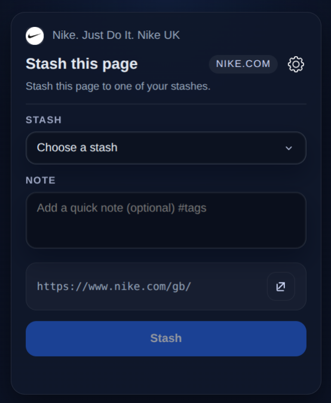

# Stash

A clean way to save links while you browse.


## What it does
- Save Airbnb links from pasted text (including short/slink URLs) or the browser extension.
- Organize links into collections with titles, notes, tags, and cover images.
- Review listings in a decision workspace with shortlist and chosen states.
- Bulk selection, auto-open control, and duplicate detection.
- Compare up to 4 listings side-by-side and resolve decision groups.
- Share read-only collection links with friends.

## Chrome extension (start here)
Stash lives in the browser so you can save a page the moment you see it.



## Run locally
From the project root:

```bash
# Install frontend deps
npm install

# Install server deps
cd server
npm install

# Start server (API on http://localhost:5000)
npm start
```

In another terminal:

```bash
# Start frontend (http://localhost:3000)
cd ..
npm start
```

## Environment variables
Create a `.env.local` file in the project root:

```
REACT_APP_SUPABASE_URL=your_supabase_url
REACT_APP_SUPABASE_ANON_KEY=your_supabase_anon_key
# Optional: public URL used in shared links (e.g. ngrok/domain)
REACT_APP_SHARE_ORIGIN=https://your-public-domain.com
```

Optional: set this Supabase Edge Function secret to use Unsplash as an extra cover source:

```bash
supabase secrets set UNSPLASH_ACCESS_KEY=your_unsplash_access_key
```

Automatic cover generation works without Unsplash by using Wikimedia/Wikipedia lookups, then query-based fallback image providers, and only then gradients.

## Project structure
```text
.
├─ src/                 # React web app source
│  ├─ components/
│  ├─ hooks/
│  ├─ lib/
│  └─ pages/
├─ public/              # Static web assets
├─ server/              # Local API server + social services
├─ supabase/
│  ├─ functions/        # Edge functions
│  └─ ...
├─ extension/           # Browser extension source
├─ migrations/          # SQL migrations
├─ docs/
│  ├─ assets/           # README/media assets
│  └─ screenshots/
└─ README.md
```

## Short roadmap
- Better parsing of TikTok comments and other short-link formats.
- Import/export collections for backup.
- Rich compare view (price, location, rating details).
- Optional collection sharing with expiration.

---
Built for fast, real-world trip planning from social discovery.
